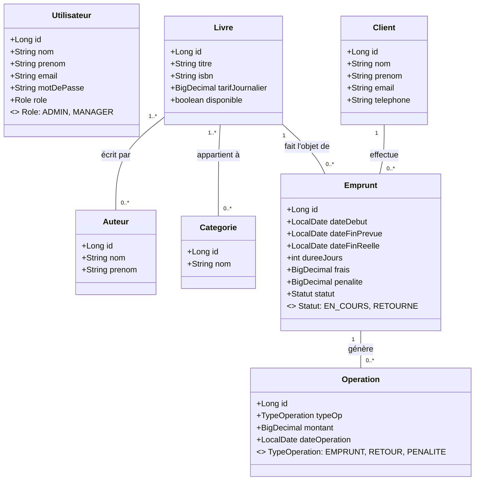
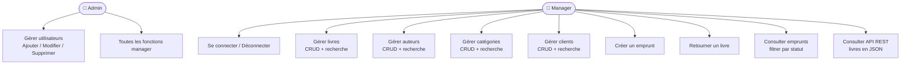
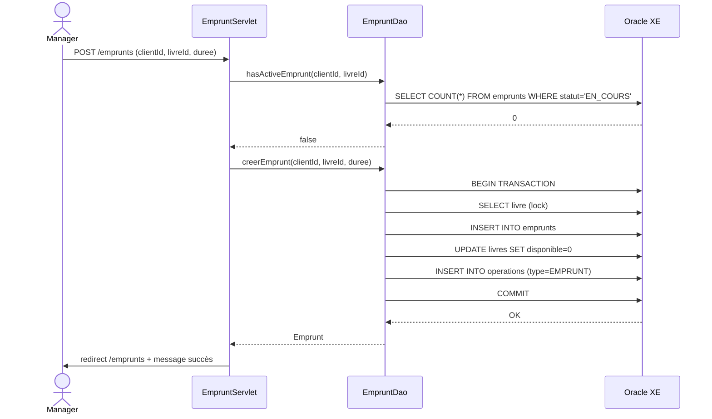
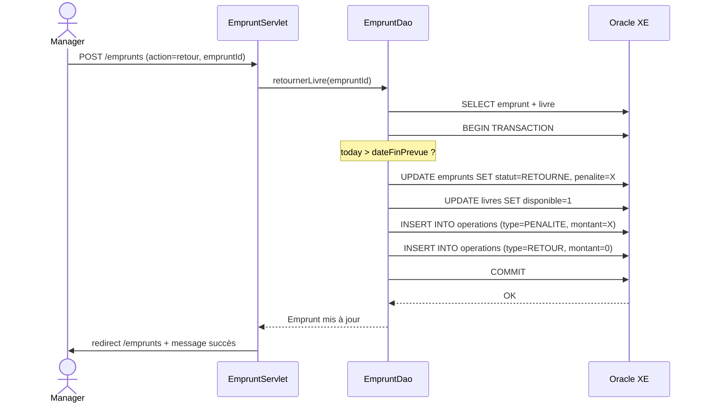
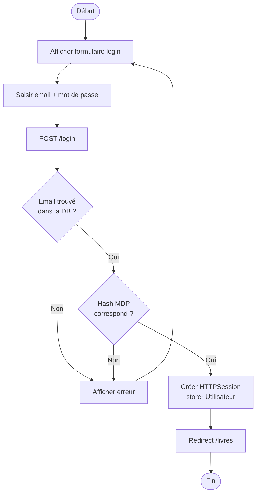
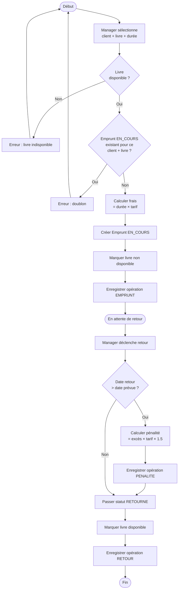

# Diagrammes UML – BiblioGest

## 1. Diagramme de classes (Modèles)

---

## 2. Diagramme de cas d'utilisation

---

## 3. Diagramme de séquence – Créer un emprunt

---

## 4. Diagramme de séquence – Retour avec pénalité

---

## 5. Diagramme d'activité – Authentification

---

## 6. Diagramme d'activité – Cycle d'un emprunt

